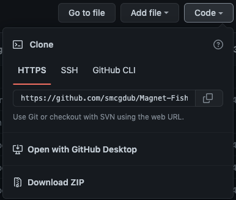

 

# **Magnet Fishing - The Worldwide Magnet Fishing Site Locations with Maps**

## **Introduction**

* Magnet Fishing UK is the database of more than 200,000 British Archaeological Sites covering the whole of England, Scotland and Wales. It is regularly updated with 10,000 new additions made to the database every year. As so many magnet fishers love metal detecting, this database helps users find the best places to do both. 

## **Table of contents** 

### **1. User Experience (UX)**
  * 1.1 Target audience
  * 1.2 Visitor goals
  * 1.3 Business goals
  * 1.4 User stories
  * 1.5 Design choices
  * 1.6 Wire frames

### **2. Features**

### **3. Technologies/Languages Used**
  * 3.1 VSCode
  * 3.2 HTML5
  * 3.3 CSS
  * 3.4 JavaScript
  * 3.5 Bootstrap (Version 5)
  * 3.6 Google fonts 
  * 3.7 Font Awesome 
  * 3.8 Pearl
  * 3.9 Video JS
  * 3.10 Balsamiq
  * 3.11 Grammarly

### **4. Testing**
  * 4.1 See [testing.md](testing.md) document 

### **5. Deployment**

  * 5.1 Deployment 
  * 5.2 Cloning 
  * 5.3 Cloning Desktop

### **6. Credits**
  * 6.1 Media
  * 6.2 Code

### **7. Contact**
  * 7.1 LinkedIn
  * 7.2 Email
  * 7.3 Skype

### **8. Disclaimer**

  * 8.1 Disclaimer on project 
___

## **1. User Experience (UX)**

### **1.1 Target Audience**

####  This website is aimed at anyone who:

### **1.2 Visitor goals**    

### **1.3 Business goals**

* The site provides some limited information ti users for free, however to access all of the recorded files users are required to have paid subscription. The business goal of the site is to drive paid subscriptions.

### **1.4 User Stories**

### **1.5 Design choices** 

#### FONTS

* I decided i would use the Google font [Ibarra Real Nova](https://fonts.google.com/specimen/Ibarra+Real+Nova) for this project.

#### ICONS

* The majority of the icons i have used on the site have come from [Font Awesome](https://fontawesome.com/) I made use of icons because they make a site look better and also give the user an idea of the type of information that they are looking at.

#### COLORS

* The bulk of the site is made up of full page background imagery. This was done intentionally so each page has its own feel without needing to do a lot of CSS to achieve this. The colors that we did use throughout the site were:

### **1.6 Wire Frames** 

<!-- Need to add these -->
[Homepage Desktop]() 
[Homepage Mobile & iPad]() 
[About Us Desktop]() 
[About Us Mobile & iPad]() 
[Cleaning Services Desktop]() 
[Cleaning Services Mobile & iPad]() 
[Our Promise Desktop]() 
[Our Promise Mobile & iPad]() 
[FAQ Desktop]() 
[FAQ Mobile & iPad]() 
[Contact Us Desktop]() 
[Contact Us Mobile & iPad]()
___
## **2. Features**

### **2.1 The Navbar**

* The Navbar i used is a standard Bootstrap 5 Navbar. The menu items in the Navbar may change over time, but the current ones we have are: 

* The site also needed to be mobile responsive, this is the main reason i chose Bootstrap for this project as it provided me with a quick and easy way of achieving this. On smaller screen sizes the navbar will collapse into a hamburger menu that when clicked will expand and reveal the nav bar items. 

### **2.2 The Footer** 

* The footer is a standard basic footer that just lists the copyright to ARCHI Information Systems and also lists myself as the developer. 
<!-- Need to insert social media icons here also -->

### **2.3 The Homepage**

* 

* The search bar

### **Search Results**

### **About Us**

* 

### **Contact Us**

* The contact us page has a contact form where users can contact the site admin. The fields on the form are: 

1. The users name - `<input type="text">`
2. The users email `<input type="email">`
3. The users message `<textarea>`
4. Send button 

### **More**

* The more dropdown menu contains 2 pages at the moment. They are the F.A.Q page and the Terms of Use page

* The FAQ page has an image instructing the user to scroll down to read the FAQ's

 

* FAQ page text displayed

 

* The Terms of Use page has an image instructing the user to scroll down to read the Terms of Use

 

* Terms of Use page text displayed

 

### **Subscribe**

* On the subscribe page users can purchase an annual subscription to ARCHI UK. Payments are currently taken via Paypal

 

### **2.12 Features Left To Implement**
___

## **3. Technologies/Languages Used**

3.1 [VS Code](https://code.visualstudio.com/) - I used Visual Studio Code for all of the coding i did during the project 
3.2 [HTML5](https://html.com/html5/#What_is_HTML) - The markup language used for this project. 
3.3 [CSS](https://en.wikipedia.org/wiki/CSS) - I used CSS to help alter and adjust the presentation of the website to create a pleasant user experience. 
3.4 [JavaScript](https://en.wikipedia.org/wiki/JavaScript) - JavaScript often abbreviated as JS, is a programming language that conforms to the ECMAScript specification. Alongside HTML and CSS, JavaScript is one of the core technologies of the World Wide Web. 
3.5 [Bootstrap 5](https://getbootstrap.com/) - Bootstrap is the most popular CSS Framework for developing responsive and mobile-first websites. Bootstrap 5 is the version i used for the development of this project. 
3.6 [Google fonts](https://fonts.google.com/) - A library of 1,023 free licensed font families for developers to choose from. 
3.7 [Font Awesome](https://fontawesome.com/) - A library of 1,600+ free to use icons that can be customized even further with CSS 
3.8 [Pearl](https://www.perl.org/) - Pearl is a highly capable, feature-rich programming language with over 30 years of development. 
3.9 [VideoJS](https://videojs.com/) - VideoJS is a web video player built from the ground up for an HTML5 world. It supports HTML5 video and modern streaming formats, as well as YouTube, Vimeo, and even Flash (through plugins, more on that later). It supports video playback on desktop and mobile devices. 
3.10 [Balsamiq](https://balsamiq.com/wireframes/?gclid=CjwKCAiAi_D_BRApEiwASslbJ_NXgCJLhWQ06W9sA_HcnQ4agJM5EJa4wWRNrXu6oJbIoz_zaiVBaRoCAScQAvD_BwE)- Balsamiq Wireframes is a rapid low-fidelity UI wireframing tool that reproduces the experience of sketching on a notepad or whiteboard. Used for producing the wire frames for this project.
3.11 [Grammarly](https://www.grammarly.com/) - Grammarly is a cloud-based typing assistant that reviews spelling, grammar, punctuation, clarity, engagement, and delivery mistakes. It uses artificial intelligence to identify and search for an appropriate replacement for the error it locates. 
___
## **4. Testing**

* Testing information can be found in the [testing.md](testing.md) file
___

## **5. Deployment**

### **5.1 Deployment**  

* The site is currently deployed on ARCHI UK servers. The link to the published site can be found by clicking here [Magnet Fishing](https://magnetfishinguk.com/)

### **5.2 Cloning**

* You can clone the projects repository to your local computer by following the steps below:

Cloning a repository using the command line

1. On github navigate to the project repository. The link can be found here: https://github.com/smcgdub/Magnet-Fishing
2. Click on the tab that says < >code 
3. Above the files, click the button that says &#8595;code

4. From the menu select HTTPS
5. Click on the clipboard icon on the right hand side (Image below)

6. Open the terminal in your IDE
7. Change the current working directory to the location where you want the cloned directory.
8. In terminal type `git clone` and then paste the URL you copied earlier 
https://github.com/smcgdub/Magnet-Fishing
9. Press Enter to create your local clone.

### **5.3 Cloning To Desktop**
You can also clone the project from Github direct to your Desktop. To do this you can do the following: 

1. On github navigate to the projects repository. The link can be found here: https://github.com/smcgdub/Magnet-Fishing
2. Click on the tab that says < >code 
3. From the dropdown menu select the option DownloadZip
4. The zipped file will now download to your desktop, drag and drop this unzipped file to your IDE and you can open the project. 
___

## **6. Credits** 

### **6.1 Media** 

### **6.2 Code** 

* Majority of the code used was Bootstrap. Their [main documentation](https://getbootstrap.com/docs/5.2/getting-started/introduction/) has most of the information you need for using the framework.
___

## **7. Contact Me**

Feel free to contact me on any of the following channels: 

* 7.1 [LinkedIn](https://www.linkedin.com/in/stephenmcgovern01/) 
* 7.2 [Email](mailto:smcgdub@gmail.com) 
* 7.3 [Skype](https://join.skype.com/invite/ndruMu7qVuKZ)
* 7.4 [My Portfolio Page](https://stephens-portfolio.com/)

___
## **8. Disclaimer**  

>